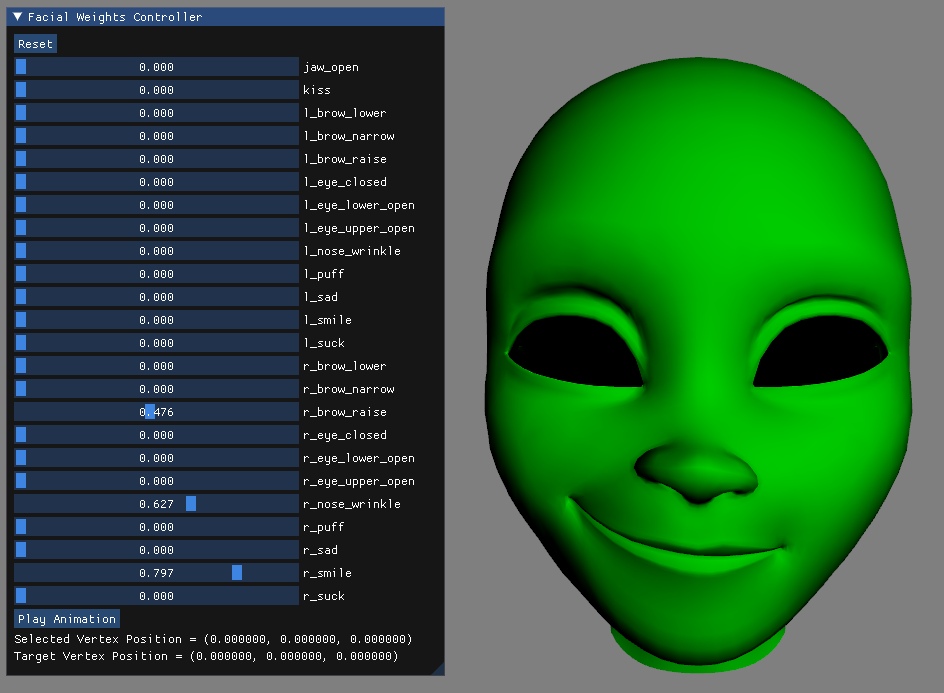

# Real-Time Animation Assignment 3 - Facial Animation
The purpose of this assignment was to implement blendshape-based facial animation. The program was written in C++ using shader-based OpenGL. There were several features to implement, including:
- Load facial expressions, save them internally as delta-blendshapes and update a facial expression after blendshape weights have been manipulated
- Create a user interface to set blendshape weights
- Implement animation playback
- Compute blendshape weights from manipulators
- Create an interface for setting, selecting and moving vertex manipulators

Interface with face model and panel where blendshapes can be selected and manipulated:

